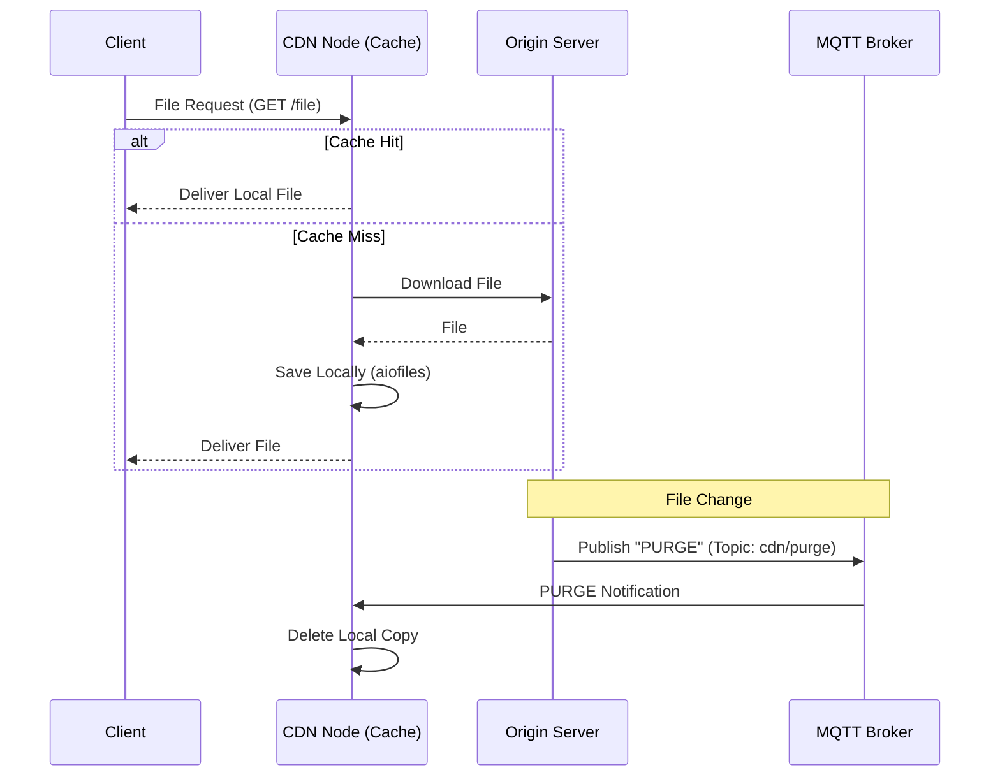

# System Structure and Operation
This document describes the architecture and detailed operation of the implemented Content Delivery Network (CDN) system.

## 1. Overview
The primary goal of this system is to minimize latency for the end user and reduce the load on the origin server. This is achieved through distributed cache nodes that store local copies of files.

### Simplified Data Flow



---

## 2. System Components
### 2.1. CDN Node (Cache Node)
The central component that interacts directly with clients.

- **Concurrent HTTP Server**: Uses `aiohttp` or `FastAPI` to handle multiple simultaneous requests.
- **Cache Manager**:
    - Checks for the file's existence in persistent storage.
    - Uses `aiofiles` for asynchronous I/O operations, ensuring the server does not block during heavy file read/write operations.
- **MQTT Client**: Subscribes to a specific topic (e.g., `cdn/purge`) to receive cache invalidation instructions.
- **Downloader**: Responsible for fetching files from the origin server in case of a *Cache Miss*.

### 2.2. Origin Server
The central repository for all files.
- Serves files via HTTP to CDN nodes.
- **MQTT Publisher**: Whenever a file is updated or removed, it sends a message to the MQTT broker with the file path to be "purged".

### 2.3. Persistent Storage (Docker)
To ensure the cache survives container restarts, the CDN node uses Docker volumes.

```yaml
services:
  cdn-node:
    image: cdn-node-image
    volumes:
      - cdn_cache:/app/cache
volumes:
  cdn_cache:
```

---

## 3. Detailed Operation
### 3.1. Request Handling and Concurrency
The CDN node is designed to be fully asynchronous. While a file is being downloaded from the origin to satisfy a *Cache Miss*, the node remains available to serve other clients requesting files already in the cache (*Cache Hit*).

### 3.2. PURGE Mechanism (Invalidation)
To prevent the CDN from serving stale data, the system uses a "Push" model via MQTT:
1. The Origin Server detects a change.
2. It publishes a message to the `cdn/purge` topic with the content `{ "file": "video_01.mp4" }`.
3. The CDN Node receives the message and executes `os.remove()` on the corresponding file.
4. The next request for that file will result in a *Cache Miss*, forcing an update from the origin.

---

## 4. Suggested Directory Structure
This may suffer some changes, but the final project should contain this main components

```text
.
├── origin_server/          # Origin Server Code
│   ├── main.py
│   └── storage/            # Original files
├── cdn_node/               # CDN Node Code
│   ├── main.py
│   ├── cache_manager.py    # aiofiles and purge logic
│   └── cache/              # Folder mounted as a volume (persistent)
├── docker-compose.yml      # System orchestration
└── README.md
```
