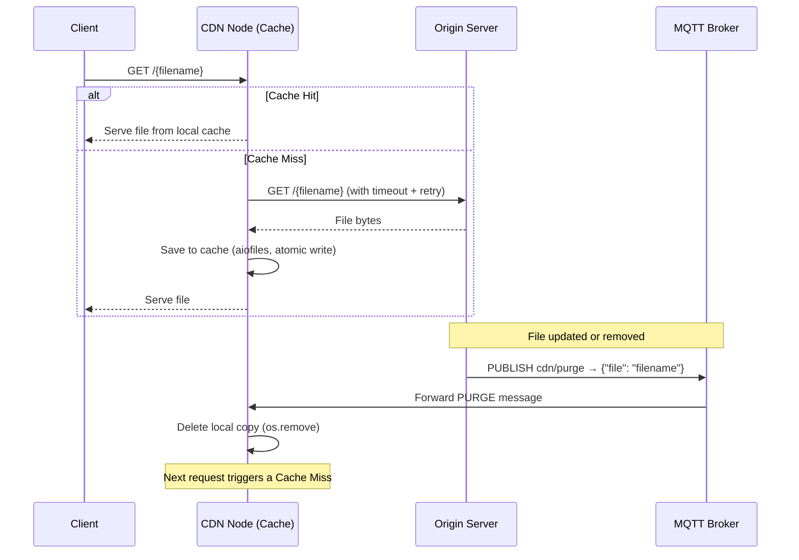

# System Structure and Operation

This document describes the current architecture and operation of the implemented CDN system.  
The system is functional but still evolving — further components, behaviours, and optimisations are planned as described in [PROBLEMS.md](./PROBLEMS.md).

---

## 1. Overview

The primary goal of this system is to minimize latency for the end user and reduce the load on the origin server. This is achieved through cache nodes that store local copies of files and only contact the origin on a cache miss.

### Data Flow



---

## 2. System Components

### 2.1. CDN Node (`cdn_node/`)

The central component that interacts directly with clients.

- **HTTP Server** (`main.py`): built with `aiohttp`, fully asynchronous, handles concurrent client requests.
- **Path Traversal Guard** (`main.py` – `_safe_filename()`): rejects filenames containing `..`, `/`, or `\`, and verifies the resolved path stays within `CACHE_DIR`. Returns **403 Forbidden** on violation.
- **Origin Fetcher** (`main.py` – `_fetch_from_origin()`): fetches files from the origin with a 5 s connect timeout and 10 s total timeout. Retries up to 3 times with exponential backoff (1 s → 2 s → 4 s). Returns **503** if the origin is unreachable, **502** if the origin returns an error status.
- **Cache Manager** (`cache_manager.py`): checks file existence, reads with `aiofiles`, writes atomically via a `.tmp` file + `os.replace()` to avoid partial content exposure.
- **MQTT Client** (`mqtt_client.py`): subscribes to `cdn/purge` (QoS 0) and calls `cache_manager.purge_file()` on each received message. Runs in a background thread via `paho-mqtt`'s `loop_start()`.

### 2.2. Origin Server (`origin_server/`)

The central repository for all files.

- **HTTP Server** (`main.py`): built with `aiohttp`, serves files from `storage/` via `GET /{filename}`.
- **Purge Endpoint** (`main.py`): `POST /purge` accepts `{"file": "filename"}` and publishes a PURGE message to the MQTT broker.
- **MQTT Publisher** (`main.py`): connects to the broker on startup and publishes to `cdn/purge` whenever a purge is triggered.

### 2.3. MQTT Broker (`mosquitto/`)

- Uses the official `eclipse-mosquitto:2.0` image.
- Configuration in `mosquitto/mosquitto.conf`: anonymous connections allowed, persistence enabled.
- Acts as the message bus between the Origin Server (publisher) and CDN Node (subscriber).

### 2.4. Persistent Storage

The CDN cache is mounted as a Docker named volume (`cdn_cache`), so cached files survive container restarts. The broker also uses named volumes for its data and logs.

---

## 3. Detailed Operation

### 3.1. Request Handling

The CDN node is fully asynchronous. On a **Cache Hit**, the file is read from disk with `aiofiles` and served immediately. On a **Cache Miss**, the node fetches the file from the origin (with timeout and retry), writes it to cache atomically, and then serves it — all without blocking other concurrent requests.

### 3.2. PURGE Mechanism (Cache Invalidation)

The system uses a push model via MQTT to prevent stale data:

1. A client calls `POST /purge` on the Origin Server with `{"file": "filename"}`.
2. The Origin publishes `{"file": "filename"}` to the `cdn/purge` MQTT topic.
3. The MQTT broker forwards the message to all subscribed CDN nodes.
4. Each CDN node deletes its local copy via `cache_manager.purge_file()`.
5. The next request for that file results in a Cache Miss, forcing a fresh fetch from the origin.

### 3.3. Security

All incoming filenames are validated by `_safe_filename()` before any cache or filesystem operation. The function performs both a string-level check (rejects `..`, `/`, `\`) and a filesystem-level check (`os.path.realpath` must resolve inside `CACHE_DIR`).

---

## 4. Environment Variables

| Variable | Default | Description |
|----------|---------|-------------|
| `ORIGIN_URL` | `http://origin:8000` | Base URL of the Origin Server (used by CDN) |
| `MQTT_BROKER` | `mqtt-broker` | Hostname of the MQTT broker |
| `CDN_PORT` | `8081` | Port the CDN HTTP server listens on |

All variables are set explicitly in `docker-compose.yml`.

---

## 5. Current Directory Structure

```text
.
├── cdn_node/                   # CDN Node
│   ├── main.py                 # HTTP server, request handler, path guard, origin fetcher
│   ├── cache_manager.py        # Cache read / write / purge (aiofiles, atomic writes)
│   ├── mqtt_client.py          # MQTT subscriber — listens for PURGE messages
│   ├── requirements.txt        # Python dependencies (aiohttp, aiofiles, paho-mqtt)
│   └── Dockerfile              # python:3.11-slim image
│
├── origin_server/              # Origin Server
│   ├── main.py                 # HTTP server + MQTT publisher
│   ├── requirements.txt        # Python dependencies (aiohttp, paho-mqtt)
│   ├── Dockerfile              # python:3.11-slim image
│   └── storage/                # Source files served to CDN nodes
│       └── test.txt
│
├── mosquitto/                  # MQTT Broker configuration
│   └── mosquitto.conf
│
├── docker-compose.yml          # Orchestration: mqtt-broker, origin, cdn-node + volumes
├── PROBLEMS.md                 # Roadmap of planned improvements (Phases 0–8)
├── TESTING.md                  # Test commands and expected behaviour
├── STRUCTURE.md                # This document
└── README.md                   # Project overview
```

> **Note:** The structure above reflects the current state of the project. As development progresses through the phases described in `PROBLEMS.md`, new components will be added (e.g. load balancer, multiple CDN nodes, metrics endpoint) and this document will be updated accordingly.