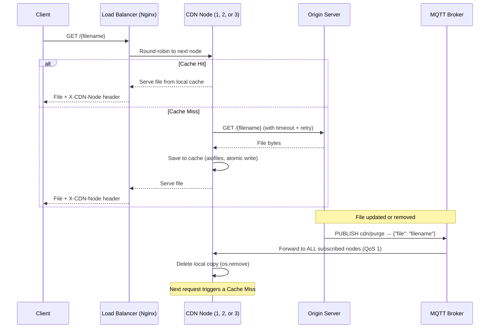

# System Structure and Operation

This document describes the current architecture and operation of the implemented CDN system.  
The system is functional but still evolving — further components, behaviours, and optimisations are planned as described in [PROBLEMS.md](./PROBLEMS.md).

---

## 1. Overview

The primary goal of this system is to minimize latency for the end user and reduce the load on the origin server. This is achieved through cache nodes that store local copies of files and only contact the origin on a cache miss.

### Data Flow



---

## 2. System Components

### 2.1. CDN Node (`cdn_node/`)

The cache node that interacts directly with clients. The same Docker image runs as three independent instances (`cdn-node-1`, `cdn-node-2`, `cdn-node-3`), each with its own named volume and MQTT client identity.

- **HTTP Server** (`main.py`): built with `aiohttp`, fully asynchronous, handles concurrent client requests.
- **Path Traversal Guard** (`main.py` – `_safe_filename()`): rejects filenames containing `..`, `/`, or `\`, and verifies the resolved path stays within `CACHE_DIR`. Returns **403 Forbidden** on violation.
- **Origin Fetcher** (`main.py` – `_fetch_from_origin()`): fetches files from the origin with a 5 s connect timeout and 10 s total timeout. Retries up to 3 times with exponential backoff (1 s → 2 s → 4 s). Returns **503** if the origin is unreachable, **502** if the origin returns an error status.
- **Singleflight / Coalescing** (`main.py`): if multiple concurrent requests arrive for the same uncached file, only one fetch is sent to the origin. All other requests wait on the same `asyncio.Future` and receive the result when it resolves.
- **Cache Manager** (`cache_manager.py`): checks file existence (with TTL expiry check), reads with `aiofiles` (updates `last_accessed`), writes atomically via a `.tmp` file + `os.replace()`. Maintains a SQLite database (`.cache_meta.db`) inside the cache volume tracking `filename`, `last_accessed`, `size_bytes`, and `expires_at` per file. After each write, triggers LRU eviction if total size exceeds `CACHE_MAX_BYTES`. Exposes `cache_stats()` for the `/cache/stats` endpoint.
- **MQTT Client** (`mqtt_client.py`): subscribes to `cdn/purge` with QoS 1 and a persistent session (`clean_session=False`), so messages queued while the node is offline are delivered on reconnect. Runs in a background thread via `paho-mqtt`'s `loop_start()`. Configures automatic reconnection and a last-will message.

### 2.2. Origin Server (`origin_server/`)

The central repository for all files.

- **HTTP Server** (`main.py`): built with `aiohttp`, serves files from `storage/` via `GET /{filename}`.
- **Purge Endpoint** (`main.py`): `POST /purge` accepts `{"file": "filename"}` and publishes a PURGE message to the MQTT broker.
- **MQTT Publisher** (`main.py`): connects to the broker on startup and publishes to `cdn/purge` whenever a purge is triggered.

### 2.3. Load Balancer (`nginx/`)

- Uses the official `nginx:1.27-alpine` image.
- Configuration in `nginx/nginx.conf`: defines a round-robin `upstream` block with all three CDN nodes.
- Exposes a single entry point on port **8090** (host). Clients always talk to this address — they never need to know which node handles their request.
- Adds an `X-CDN-Node` response header showing the upstream IP that served the request, useful for debugging and Wireshark analysis.

### 2.4. MQTT Broker (`mosquitto/`)

- Uses the official `eclipse-mosquitto:2.0` image.
- Configuration in `mosquitto/mosquitto.conf`: anonymous connections allowed, persistence enabled.
- Acts as the message bus between the Origin Server (publisher) and all CDN nodes (subscribers). A single PURGE publish reaches all three nodes simultaneously.

### 2.5. Persistent Storage

Each CDN node has its own named Docker volume (`cdn_cache_1`, `cdn_cache_2`, `cdn_cache_3`), so caches are fully independent and survive container restarts. The broker also uses named volumes for its data and logs.

---

## 3. Detailed Operation

### 3.1. Request Handling

Clients connect to the **load balancer** on port 8090. Nginx distributes requests across the three CDN nodes in round-robin order. Each node is fully asynchronous — on a **Cache Hit**, the file is read from its own local disk with `aiofiles` and served immediately. On a **Cache Miss**, the node fetches the file from the origin (with timeout and retry), writes it to its own cache volume atomically, and then serves it — all without blocking other concurrent requests.

Because each node has an independent cache, a file may be a Miss on node 2 even if node 1 already cached it. This is intentional: it demonstrates true horizontal scalability with no shared state between nodes.

### 3.2. PURGE Mechanism (Cache Invalidation)

The system uses a push model via MQTT to prevent stale data:

1. A client calls `POST /purge` on the Origin Server with `{"file": "filename"}`.
2. The Origin publishes `{"file": "filename"}` to the `cdn/purge` MQTT topic.
3. The MQTT broker forwards the message to all subscribed CDN nodes.
4. Each CDN node deletes its local copy via `cache_manager.purge_file()`.
5. The next request for that file results in a Cache Miss, forcing a fresh fetch from the origin.

### 3.3. Security

All incoming filenames are validated by `_safe_filename()` before any cache or filesystem operation. The function performs both a string-level check (rejects `..`, `/`, `\`) and a filesystem-level check (`os.path.realpath` must resolve inside `CACHE_DIR`).

---

## 4. Environment Variables

| Variable | Default | Description |
|----------|---------|-------------|
| `ORIGIN_URL` | `http://origin:8000` | Base URL of the Origin Server (used by CDN nodes) |
| `MQTT_BROKER` | `mqtt-broker` | Hostname of the MQTT broker |
| `CDN_PORT` | `8081` | Port each CDN node listens on (internal) |
| `NODE_ID` | `cdn-node` | Unique identity for MQTT client and log prefixes |
| `CACHE_MAX_BYTES` | `104857600` (100 MB) | Maximum total cache size per node before LRU eviction triggers |
| `CACHE_TTL_SECONDS` | `0` (disabled) | If > 0, origin sends `Cache-Control: max-age=N`; CDN nodes expire entries after N seconds |

All variables are set explicitly in `docker-compose.yml`.

---

## 5. Current Directory Structure

```text
.
├── cdn_node/                   # CDN Node (shared image, 3 instances)
│   ├── main.py                 # HTTP server, path guard, origin fetcher, singleflight
│   ├── cache_manager.py        # Cache read / write / purge (aiofiles, atomic writes)
│   ├── mqtt_client.py          # MQTT subscriber — QoS 1, persistent session, auto-reconnect
│   ├── requirements.txt        # Python dependencies (aiohttp, aiofiles, paho-mqtt)
│   └── Dockerfile              # python:3.11-slim image
│
├── origin_server/              # Origin Server
│   ├── main.py                 # HTTP server + MQTT publisher
│   ├── requirements.txt        # Python dependencies (aiohttp, paho-mqtt)
│   ├── Dockerfile              # python:3.11-slim image
│   └── storage/                # Source files served to CDN nodes
│       └── test.txt
│
├── mosquitto/                  # MQTT Broker configuration
│   └── mosquitto.conf
│
├── nginx/                      # Load Balancer configuration
│   └── nginx.conf              # Round-robin upstream: cdn-node-1, cdn-node-2, cdn-node-3
│
├── docker-compose.yml          # Orchestration: broker, origin, 3× cdn-node, load-balancer + volumes
├── PROBLEMS.md                 # Roadmap of planned improvements (Phases 0–8)
├── TESTING.md                  # Test commands and expected behaviour
├── STRUCTURE.md                # This document
└── README.md                   # Project overview
```

> **Note:** The structure above reflects the current state of the project. As development progresses through the phases described in `PROBLEMS.md`, new components will be added and this document will be updated accordingly.

---

## 6. Planned Expansions

The following are the main areas where the system will evolve. Full details in [PROBLEMS.md](./PROBLEMS.md).

- **Phase 5** – Observability (Prometheus metrics, structured JSON logs, health endpoints)
- **Phase 6** – Security hardening (rate limiting, MQTT authentication, HTTPS)
- **Phase 7** – Load and resilience testing (Locust / k6)
